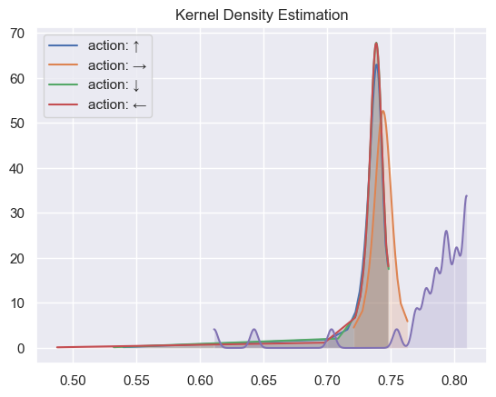
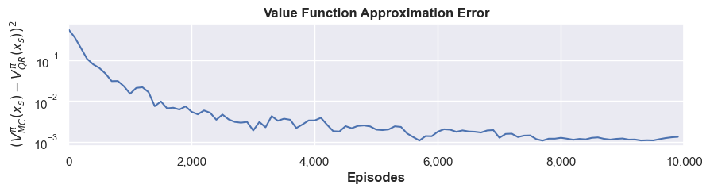
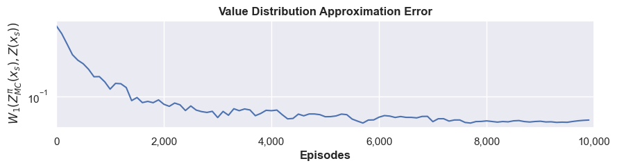
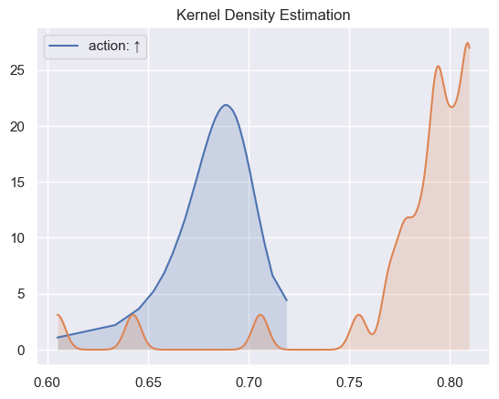
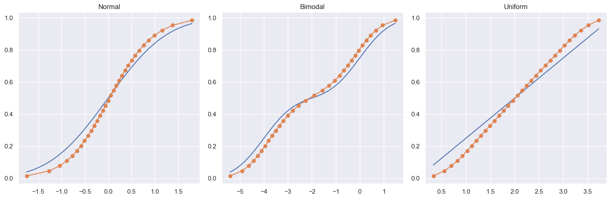

0 - Experiments:

01 : Simplified Environment, with a single state and action. With a sufficient amount of N_taus compare Huber vs Simple QR.
also compare mean V() vs Q-learning?

Explain montecarlo, used for finding ground truth in stoatschits environment.
Explain cliff simple environment (windy)

02 : CliffSimple, compare with both huber and non huber again, this time to show how they are good at different things. also compare to Qlearning

Explain windyrooms environment.
Variants?

03 : WindyRooms, compare with huber if relevant?

PLOT THE VARIANCE TOO

1 - Compare Off-policy / On-policy for the methods.

11 : Cliff simple, off policy, shouldn't be too hard, but many values won't be visited enough, without very high epsilon

12 : Windyrooms, VERY slow, takes unfeasibly long to run, and doesn't even give good results.

# ???

Prøvede forskellige environments, såsom FrozenLake og variationer af Cliff og WindyRooms, men nogle af dem lader til at fucked det helt op.

### QR 10k on-policy:

Value function approx error:  

Value distribution approx error:  

Even setting the amount of episodes up won't ever make the distributions any closer to the MC distribution. Both the wasserstein metric and the squared error are off by a factor of 10 compared to the paper.

### QR 40k episodes on-policy:  

### Simple QR

It does not make sense why none of the 3 distributions can be fully modeled, even with any configuration of decaying learning rate.